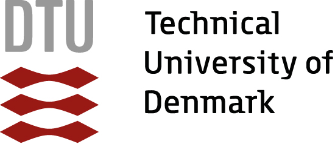

Cryptographic primitives realized with few multiplications can significantly improve (or even enable!) applications in areas as diverse as homomorphic encryption, side-channel attack countermeasures, secure multiparty computation, or zero-knowledge proofs.

This one-time workshop aims to provide an overview of results, applications and current research in this area. This covers theory, design and analysis, as well as implementations. Major goals are to bring together researchers from the unusual set of relevant disciplines within cryptography/security and outside (e.g. circuit complexity), and to identify open problems and more applications.

 * **Location:** [Jussieu campus of Université Pierre et Marie Curie](https://www.ieee-security.org/TC/EuroSP2017/venue.php) Room 116
 * **Date:** Sunday, April 30th, 2017

## Program

| **Time**      | **Speaker**               | **Title**     |
|:--------------|:--------------------------|:--------------|
| 08:00--09:00  | Breakfast                 |               |
| **Intro and Session on Side-Channel Topics** |      |               |
| 09:30--09:45  |  Christian Rechberger     | Introduction |
| 09:45--10:30  | Begül Bilgin              | FewMul-FewDepth-FewLength Triangle |
| 10:30--11:00  | Break                     |               |
| **Session on Foundations** |              |               |
| 11:00--12:00  | Rene Peralta              | Functions with known multiplicative complexity |
| 12:00--14:00  | Lunch                     |               |
| **Session on Applications: MPC and SNARKS** |             |               |
| 14:00--14:45  | Arnab Roy                 | MiMC and SNARKS  |
| 14:45--15:30  | Emmanuela Orsini          | Efficient evaluation of symmetric primitives in MPC |
| 15:30--16:00  | Break                     |               |
| **Session on Conrete Constructions** | |       |
| 16:00--16:45  | Pavol Zajac               | Multiplicative complexity in block cipher design and analysis |
| 16:45--17:30  | Tyge Tiessen              | [LowMC v3: a security update application](talks/tiessen.pdf) | 
## Organizer

**Christian Rechberger**

## Organizing institutions

## Sponsors

